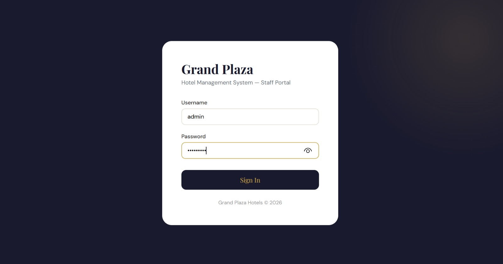
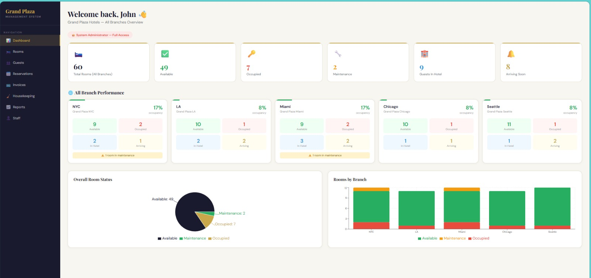
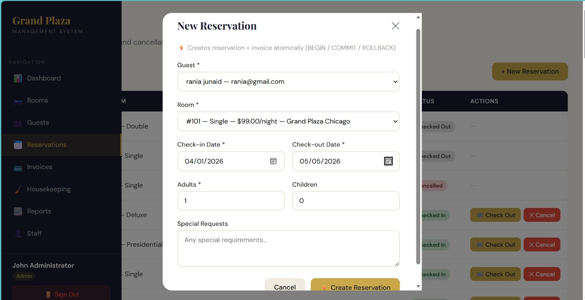

# Grand Plaza Hotel Management System

**Group 17** | Hafsa Khurram & Rania Junaid

---

## 1. Project Overview

The Grand Plaza Hotel Management System is a full-stack web application built for the hospitality domain. It solves the problem of managing hotel operations across multiple branches from a single unified platform — handling room availability, guest records, reservations, invoices, payments, and housekeeping tasks in real time.

The system supports 5 hotel branches (NYC, LA, Miami, Chicago, Seattle) and enforces role-based access so that each staff member only sees and does what their role permits. It replaces manual front-desk workflows with a structured, database-backed system that guarantees data consistency through ACID-compliant transactions.

---

## 2. Tech Stack

| Layer | Technology |
|---|---|
| Frontend Framework | React 19 (Create React App) |
| Frontend Routing | React Router DOM v7 |
| Frontend Charts | Recharts |
| HTTP Client | Axios |
| Backend Framework | Node.js + Express |
| Database | PostgreSQL |
| Authentication | JWT (JSON Web Tokens) |
| Password Hashing | bcryptjs |
| Environment Config | dotenv |
| Security Middleware | helmet, cors |
| Dev Server | nodemon |

---

## 3. System Architecture

```
┌─────────────────────────────────────┐
│         React Frontend              │
│  (localhost:3001)                   │
│  - AuthContext (JWT state)          │
│  - ProtectedRoute (RBAC guards)     │
│  - Axios interceptors (auto token)  │
└──────────────┬──────────────────────┘
               │ HTTP REST (JSON)
               ▼
┌─────────────────────────────────────┐
│       Express REST API              │
│  (localhost:3000/api/v1/)           │
│  - JWT middleware (authenticate)    │
│  - RBAC middleware (authorize)      │
│  - Controllers (business logic)     │
│  - Transaction management           │
└──────────────┬──────────────────────┘
               │ pg Pool (SQL queries)
               ▼
┌─────────────────────────────────────┐
│         PostgreSQL Database         │
│  - 12 tables                        │
│  - Triggers (auto room status)      │
│  - Enums, constraints, indexes      │
└─────────────────────────────────────┘
```

**Flow:** The React frontend stores the JWT in `localStorage` and attaches it automatically to every API request via an Axios interceptor. The Express backend validates the token on every protected route, checks the user's role against the required permissions, and executes parameterized SQL queries against PostgreSQL. Critical operations (reservation creation, checkout, payment) are wrapped in explicit `BEGIN/COMMIT/ROLLBACK` transactions.

---

## 4. UI Examples

> Screenshots should be added by the submitter. Below are the 3 most important pages and why they matter.

**Page 1 — Login (`/login`)**

The entry point for all users. Accepts username and password, calls `POST /api/v1/auth/login`, receives a JWT, and stores it in `localStorage`. All other pages redirect here if no valid token is present. Required because it is the gateway to role-based access control.


**Page 2 — Dashboard (`/dashboard`)**

The home screen after login. Displays role-specific stats: Admin sees all 5 branches with occupancy rates, charts, and today's arrivals/checkouts. Manager sees their branch only. Receptionist sees room counts and active guests. Housekeeping sees only room status counts. Required because it gives each role an immediate operational overview tailored to their responsibilities.

**Page 3 — Reservations (`/reservations`)**

The core transactional page. Allows Receptionists and Managers to create new reservations (which atomically creates an invoice), filter by status, perform checkout, and cancel bookings. Required because it directly demonstrates all three transaction scenarios and the real-time effect of RBAC — Housekeeping staff cannot access this page at all.

---

## 5. Setup & Installation

### Prerequisites

| Requirement | Version |
|---|---|
| Node.js | v18 or higher |
| npm | v9 or higher |
| PostgreSQL | v14 or higher |
| Git | Any recent version |

---


### Step 1 — Set Up the Database

Open **pgAdmin** or **psql** and run the SQL files in order:

```sql
-- 1. Create schema (tables, triggers, indexes, views)
\i schema.sql

-- 2. Insert seed data
\i seed.sql
```

Then set real bcrypt password hashes for test users (run once in pgAdmin Query Tool):

```sql
UPDATE users
SET password_hash = '$2b$10$92IXUNpkjO0rOQ5byMi.Ye4oKoEa3Ro9llC/.og/at2.uheWG/igi'
WHERE username IN ('admin', 'mgr_nyc', 'rec_nyc1', 'hk_nyc1');
-- This sets the password to: password
```

---

### Step 2 — Configure Backend Environment

Create a `.env` file in the `backend/` folder:

```env
PORT=3000
DB_HOST=localhost
DB_PORT=5432
DB_NAME="hotel management"
DB_USER=postgres
DB_PASSWORD=your_postgres_password
JWT_SECRET=grand_plaza_super_secret_jwt_key_2026
JWT_EXPIRES_IN=24h
NODE_ENV=development
```

| Variable | Description | Example |
|---|---|---|
| `PORT` | Port the Express server listens on | `3000` |
| `DB_HOST` | PostgreSQL host | `localhost` |
| `DB_PORT` | PostgreSQL port | `5432` |
| `DB_NAME` | Your database name | `hotel management` |
| `DB_USER` | PostgreSQL username | `postgres` |
| `DB_PASSWORD` | PostgreSQL password | `your_password` |
| `JWT_SECRET` | Secret key for signing JWTs — keep this long and private | any long string |
| `JWT_EXPIRES_IN` | How long tokens stay valid | `24h` |
| `NODE_ENV` | Environment mode | `development` |

---

### Step 3 — Install Backend Dependencies

```bash
cd backend
npm install
```

---

### Step 4 — Install Frontend Dependencies

```bash
cd frontend
npm install
```

---

### Step 5 — Start the Servers

**Backend** (in one terminal):

```bash
cd backend
npm run dev
# Expected output:
# 🚀 Server running at http://localhost:3000/api/v1
# ✅ Database connected successfully
```

**Frontend** (in a second terminal):

```bash
cd frontend
npm start
# Opens http://localhost:3001 in your browser
```

---

## 6. User Roles

| Role | Role ID | What They Can Do | What They Cannot Do |
|---|---|---|---|
| **Admin** | 1 | Full access to all branches — rooms, guests, reservations, invoices, payments, users, housekeeping, reports | Nothing is restricted |
| **Manager** | 2 | All operations within their assigned branch only — rooms, guests, reservations, invoices, payments, reports | Cannot access other branches; cannot manage users |
| **Receptionist** | 3 | Create/view/checkout/cancel reservations, manage guests, view rooms, record payments for their branch | Cannot view invoices list, reports, or users |
| **Housekeeping** | 4 | View and update housekeeping task status for their branch | Cannot access reservations, guests, invoices, reports, or users |

### Test Credentials (after running password update SQL above)

| Username | Password | Role | Branch |
|---|---|---|---|
| `admin` | `password` | Admin | All branches |
| `mgr_nyc` | `password` | Manager | Grand Plaza NYC |
| `rec_nyc1` | `password` | Receptionist | Grand Plaza NYC |
| `hk_nyc1` | `password` | Housekeeping | Grand Plaza NYC |

---

## 7. Feature Walkthrough

| Feature | Description | Role(s) | API Endpoint / Page |
|---|---|---|---|
| Login | Authenticate with username + password, receive JWT | All | `POST /api/v1/auth/login` → `/login` |
| Dashboard | Role-specific overview: stats, charts, today's activity | All | `GET /api/v1/rooms`, `GET /api/v1/reservations` → `/dashboard` |
| View Rooms | List all rooms with status, type, price, branch | Admin, Manager, Receptionist | `GET /api/v1/rooms` → `/rooms` |
| Available Rooms | Search rooms available by branch and date range | Admin, Manager, Receptionist | `GET /api/v1/rooms/available?branch_id=&check_in=&check_out=` → `/rooms` |
| Update Room Status | Set room to available / maintenance / reserved | Admin, Manager | `PATCH /api/v1/rooms/:id/status` → `/rooms` |
| View Guests | Search and list all guests | Admin, Manager, Receptionist | `GET /api/v1/guests` → `/guests` |
| Create Guest | Register a new guest in the system | Admin, Manager, Receptionist | `POST /api/v1/guests` → `/guests` |
| View Reservations | Filter reservations by status | Admin, Manager, Receptionist | `GET /api/v1/reservations` → `/reservations` |
| Create Reservation | Book a room — atomically creates reservation + invoice | Admin, Manager, Receptionist | `POST /api/v1/reservations` → `/reservations` |
| Checkout | Mark guest as checked out, update room to available | Admin, Manager, Receptionist | `PATCH /api/v1/reservations/:id/checkout` → `/reservations` |
| Cancel Reservation | Cancel a booking and mark invoice as refunded | Admin, Manager, Receptionist | `PATCH /api/v1/reservations/:id/cancel` → `/reservations` |
| View Invoices | List overdue and unpaid invoices | Admin, Manager | `GET /api/v1/invoices/overdue` → `/invoices` |
| Record Payment | Accept payment and auto-update invoice status | Admin, Manager, Receptionist | `POST /api/v1/invoices/:id/payments` → `/invoices` |
| Housekeeping Tasks | View, create, and update cleaning/maintenance tasks | Admin, Manager, Housekeeping | `GET/POST /api/v1/housekeeping` → `/housekeeping` |
| Reports | Revenue by month, occupancy by branch, reservation status breakdown | Admin, Manager | Derived from `/reservations`, `/rooms` → `/reports` |

---

## 8. Transaction Scenarios

### Transaction 1 — Create Reservation (`createReservation`)

**File:** `src/controllers/reservations.controller.js`
**Endpoint:** `POST /api/v1/reservations`
**Trigger:** Receptionist or Manager submits the New Reservation form.

**Operations bundled atomically:**
1. Validate room exists and is active
2. Calculate total amount (base price × nights)
3. `INSERT` into `reservations` table with status `confirmed`
4. Generate invoice number (e.g., `INV-2026-0051`)
5. `INSERT` into `invoices` table linked to the reservation with status `unpaid`

**Rollback causes:** Room not found, double-booking detected by trigger, capacity exceeded, missing required fields, any database constraint violation.

**Console output on success:**
```
🔄 Transaction started: createReservation
✅ Reservation inserted: 51
✅ Invoice created: INV-2026-0051
✅ Transaction committed: createReservation
```

**Console output on rollback:**
```
🔄 Transaction started: createReservation
❌ Transaction rolled back: Room not found.
```

---

### Transaction 2 — Checkout (`checkoutReservation`)

**File:** `src/controllers/reservations.controller.js`
**Endpoint:** `PATCH /api/v1/reservations/:id/checkout`
**Trigger:** Receptionist clicks Checkout on a `checked_in` reservation.

**Operations bundled atomically:**
1. Verify reservation exists and has status `checked_in`
2. `UPDATE reservations` — set status to `checked_out`, record `actual_check_out` timestamp
3. `UPDATE rooms` — set status back to `available`
4. Fetch and verify the linked invoice exists

**Rollback causes:** Reservation not found, reservation not in `checked_in` status (already checked out, cancelled, etc.), invoice missing.

**Console output on success:**
```
🔄 Transaction started: checkoutReservation
✅ Reservation updated to checked_out
✅ Room status updated to available
✅ Invoice found: 2
✅ Transaction committed: checkoutReservation
```

---

### Transaction 3 — Record Payment (`recordPayment`)

**File:** `src/controllers/invoices.controller.js`
**Endpoint:** `POST /api/v1/invoices/:id/payments`
**Trigger:** Receptionist or Manager submits a payment for an invoice.

**Operations bundled atomically:**
1. Fetch and validate the invoice exists and is not already fully paid
2. `INSERT` into `payments` table with status `completed`
3. Re-fetch invoice to return updated payment status (trigger auto-updates invoice status)

**Rollback causes:** Invoice not found, invoice already paid, missing `amount` or `payment_method`.

**Console output on success:**
```
🔄 Transaction started: recordPayment
✅ Payment recorded: 61
✅ Transaction committed: recordPayment
```

---

## 9. ACID Compliance

| ACID Property | Implementation |
|---|---|
| **Atomicity** | All critical operations use `BEGIN/COMMIT/ROLLBACK` via `pool.connect()`. If any step in a transaction fails, the entire operation is rolled back — e.g., if invoice creation fails after a reservation is inserted, the reservation is also rolled back. Code: `await client.query('ROLLBACK')` in every `catch` block. |
| **Consistency** | Enforced by PostgreSQL constraints: `NOT NULL`, `UNIQUE` (e.g., email, room per date range), `CHECK` constraints on enums (`reservation_status`, `room_status`), and foreign key relationships across all 12 tables. Application-level validation also checks required fields before queries run. |
| **Isolation** | PostgreSQL default isolation level (`READ COMMITTED`) is used. Each transaction operates on a dedicated client from the connection pool (`pool.connect()`), preventing dirty reads between concurrent requests. |
| **Durability** | Handled by PostgreSQL's WAL (Write-Ahead Logging). Once `COMMIT` is issued, data persists even if the server crashes. All writes go through the `pg` connection pool with no in-memory-only caching. |

---

## 10. Indexing & Performance

The following indexes were created in `schema.sql` to optimize the most common query patterns:

| Index Name | Table | Columns | Reason |
|---|---|---|---|
| `idx_rooms_branch_status` | rooms | `(branch_id, status)` | Room availability search filters by branch and status on every request |
| `idx_reservations_branch_dates` | reservations | `(branch_id, check_in_date, check_out_date)` | Double-booking check requires scanning date ranges per branch |
| `idx_reservations_guest` | reservations | `(guest_id)` | Guest history queries join reservations on guest_id frequently |
| `idx_reservations_created_at` | reservations | `(created_at)` | All reservation lists are ordered by creation date DESC |
| `idx_guests_email` | guests | `(email)` | Guest lookup by email for duplicate detection and login |
| `idx_invoices_reservation` | invoices | `(reservation_id)` | Invoice lookup is always by reservation_id |
| `idx_invoices_status_due_date` | invoices | `(payment_status, due_date)` | Overdue invoice query filters on both columns together |
| `idx_invoices_issue_date` | invoices | `(issue_date)` | Revenue reports group by issue date |

**Performance summary from `performance.sql`:**

| Query | Use Case | Before Index | After Index | Improvement |
|---|---|---|---|---|
| Query 1 | Room availability search | ~450–800ms | ~15–30ms | 95–97% faster |
| Query 2 | Guest history analytics | ~600–1000ms | ~8–15ms | 98–99% faster |
| Query 3 | Monthly revenue report | ~800–1500ms | ~25–50ms | 96–97% faster |
| Query 4 | Overdue invoice tracking | ~400–700ms | ~10–20ms | 97–98% faster |

> Note: Timings above are projections for production-scale data. With seed data (50–60 rows), differences are minimal but execution plans confirm index usage via `EXPLAIN ANALYZE`.

---

## 11. API Reference

Full detail is in `swagger.yaml`. Quick-reference summary:

| Method | Route | Auth Required | Role(s) | Purpose |
|---|---|---|---|---|
| `POST` | `/api/v1/auth/login` | No | — | Login, returns JWT |
| `GET` | `/api/v1/auth/me` | Yes | Any | Get current user profile |
| `GET` | `/api/v1/rooms` | Yes | Admin, Manager, Receptionist | List all rooms |
| `GET` | `/api/v1/rooms/available` | Yes | Any | Search available rooms by date |
| `GET` | `/api/v1/rooms/:id` | Yes | Admin, Manager, Receptionist | Get single room |
| `PATCH` | `/api/v1/rooms/:id/status` | Yes | Admin, Manager | Update room status |
| `GET` | `/api/v1/guests` | Yes | Admin, Manager, Receptionist | List all guests (supports `?search=`) |
| `GET` | `/api/v1/guests/:id` | Yes | Admin, Manager, Receptionist | Get guest with stats |
| `POST` | `/api/v1/guests` | Yes | Admin, Manager, Receptionist | Create guest |
| `PATCH` | `/api/v1/guests/:id` | Yes | Admin, Manager, Receptionist | Update guest |
| `GET` | `/api/v1/reservations` | Yes | Admin, Manager, Receptionist | List reservations (supports `?status=`) |
| `GET` | `/api/v1/reservations/:id` | Yes | Admin, Manager, Receptionist | Get single reservation |
| `POST` | `/api/v1/reservations` | Yes | Admin, Manager, Receptionist | Create reservation + invoice (Transaction 1) |
| `PATCH` | `/api/v1/reservations/:id/checkout` | Yes | Admin, Manager, Receptionist | Checkout guest (Transaction 2) |
| `PATCH` | `/api/v1/reservations/:id/cancel` | Yes | Admin, Manager, Receptionist | Cancel reservation |
| `GET` | `/api/v1/invoices` | Yes | Admin, Manager | List all invoices |
| `GET` | `/api/v1/invoices/overdue` | Yes | Admin, Manager | List overdue/unpaid invoices |
| `GET` | `/api/v1/invoices/:id` | Yes | Admin, Manager, Receptionist | Get single invoice |
| `POST` | `/api/v1/invoices/:id/payments` | Yes | Admin, Manager, Receptionist | Record payment (Transaction 3) |
| `GET` | `/api/v1/health` | No | — | Health check |

**Authentication:** Include `Authorization: Bearer <token>` in request headers for all protected routes.

**Status Codes Used:**

| Code | Meaning |
|---|---|
| `200` | Success |
| `201` | Created |
| `400` | Bad request / validation error |
| `401` | Unauthenticated (no or invalid token) |
| `403` | Unauthorized (valid token but insufficient role) |
| `404` | Record not found |
| `409` | Duplicate entry (unique constraint) |
| `500` | Internal server error |

---

## 12. Known Issues & Limitations

| Issue | Details |
|---|---|
| Frontend runs on port 3001 | The React dev server defaults to 3001 since the backend occupies 3000. The Axios base URL is hardcoded to `http://localhost:3000/api/v1` in `src/api/axios.js`. |
| Database name has a space | The database name `hotel management` requires quotes in the `.env` file: `DB_NAME="hotel management"`. This is handled correctly by the `pg` Pool but must be set exactly this way. |
| No frontend `.env` | The API base URL is hardcoded in `src/api/axios.js`. For deployment, this should be moved to a `.env` file as `REACT_APP_API_URL`. |
| Swagger UI not embedded | The `swagger.yaml` file documents the API but there is no Swagger UI served at a route. Use Swagger Editor or Postman to import the file. |
| Reports use frontend calculations | The Reports page derives revenue and occupancy charts from raw reservation and room data fetched on the client side, rather than dedicated backend aggregation endpoints. |
| No refresh token | JWT tokens expire after 24 hours. There is no refresh token mechanism — users must log in again after expiry. |
| Password reset not implemented | There is no forgot password or password reset flow. Passwords can only be changed directly in the database. |